<div align="center">
  
  <h1>🚀 Modexia Python SDK</h1>
  <p><b>The ultimate Python client for AI Agents to seamlessly interact with Modexia's AgentPay API.</b></p>
  
  [](https://badge.fury.io/py/modexiaagentpay)
  [](https://pypi.org/project/modexiaagentpay/)
  [](https://opensource.org/licenses/MIT)
  [](https://github.com/psf/black)
</div>

<br />

Welcome to the **Modexia Python SDK** (`modexiaagentpay`). Built from the ground up to give your AI agents and Python applications frictionless access to Modexia's wallet and payment infrastructure. Enable your AI to hold, manage, and transfer USDC with just a few lines of code!

---

## 🌟 Getting Started: Your API Key

Before writing your first integration, you will need a Modexia developer account and an API key. 

1. **Visit [modexia.software](https://modexia.software)**
2. Create or log into your developer account.
3. Navigate to your dashboard and generate your **API Key**.

For deep dives, architecture, and advanced agentic payment flows, dive into our **[Full Documentation](https://modexia.software/docs)**.

---

## 🏗 System Architecture & Flow

The Modexia SDK handles complex blockchain transactions and HTTP retries under the hood, presenting your agents with a hyper-clean interface.

```mermaid
sequenceDiagram
    participant Agent as 🤖 AI Agent (Your App)
    participant SDK as 📦 Modexia Python SDK
    participant API as 🌐 Modexia AgentPay API
    participant Chain as ⛓️ Blockchain (USDC)

    Agent->>SDK: transfer(recipient, amount, wait=True)
    SDK->>API: POST /v1/payments (with API Key)
    API-->>SDK: Transaction Pending (TxHash)
    
    rect rgb(40, 44, 52)
    Note over SDK, API: SDK Automatically Polls API
    loop Polling Status
        SDK->>API: GET /v1/payments/{id}/status
        API-->>SDK: Status: Pending...
    end
    end
    
    API->>Chain: Broadcasts USDC Transfer
    Chain-->>API: Transaction Confirmed
    API-->>SDK: Status: Completed
    SDK-->>Agent: Returns Full Receipt! 🎉
```



---

## ✨ Top-Level Features

- **Built for AI Agents:** Designed specifically for programmatic access to agent wallets and payments without complex cryptography.
- **Reliable Networking:** Built-in retry and exponential backoff mechanisms to gracefully handle transient network errors.
- **Minimalist API:** A clean, strongly-typed interface via `ModexiaClient` exposing intuitive `transfer` and `retrieve_balance` methods.
- **Zero Bloat:** Extremely lightweight. Relies purely on the standard `requests` library.

---

## 📦 Installation

Install the production-ready package directly from PyPI:

```bash
pip install modexiaagentpay
```

*For local development and contribution:*
```bash
git clone https://github.com/Modaniel/SDKs.git
cd SDKs
pip install -e packages/SDKs/pythonSdk
```

---

## 🚀 Quick Start Guide

Initialize the client with your Modexia API key and empower your application to make real-world transactions instantly.

```python
from modexia import ModexiaClient

# 1. Initialize the client using the API key you generated at modexia.software
# (It also respects the MODEXIA_BASE_URL environment variable!)
client = ModexiaClient(api_key="mx_test_your_api_key_here")

# 2. Check your agent's wallet balance
try:
    balance = client.retrieve_balance() # Or client.get_balance()
    print(f"💰 Current wallet balance: {balance} USDC")
except Exception as e:
    print(f"Failed to fetch balance: {e}")

# 3. Execute a secure transfer!
# Setting wait=True ensures the SDK polls until the blockchain confirms the transaction.
receipt = client.transfer(
    recipient="0xabc123456789def0123456789abc0123456789def", 
    amount=5.0, 
    wait=True
)

print(f"✅ Transfer successful! View receipt details: {receipt}")
```

---

## 🛠 API Reference

### `ModexiaClient`
The core class for all network operations.

```python
ModexiaClient(
    api_key: str, 
    timeout: int = 15, 
    base_url: Optional[str] = None, 
    validate: bool = True
)
```

#### Core Methods
| Method | Description | Returns |
|--------|-------------|---------|
| `retrieve_balance()` | Fetches the current USDC balance of your agent's wallet. | `str` |
| `get_balance()` | An alias for `retrieve_balance()`. | `str` |
| `transfer(recipient, amount, idempotency_key=None, wait=True)` | Send funds to a destination address. Automatically handles polling if `wait` is True. | `dict` (Receipt) |

### 🛑 Exception Handling

The SDK provides robust error mapping to help your agent gracefully recover from failures:


---

## 🤝 Contributing to Open Source

We actively welcome community contributions to make this SDK even better. 

1. **Fork & Branch:** Open a Pull Request targeting the `develop` branch.
2. **Backward Compatibility:** Please keep API contracts stable. `ModexiaClient`, `transfer()`, and `retrieve_balance()` are canonical.
3. **Testing:** Make sure tests pass locally before submitting.

```bash
# Run tests from the repository root
pytest -q packages/SDKs/pythonSdk
```

---

## 📄 License & Support

**modexiaagentpay** is totally open-source and governed by the [MIT License](LICENSE).

Need help scaling your agent swarm? Hit rate limits? Reach out to our engineering team or explore the docs at [modexia.software](https://modexia.software).
